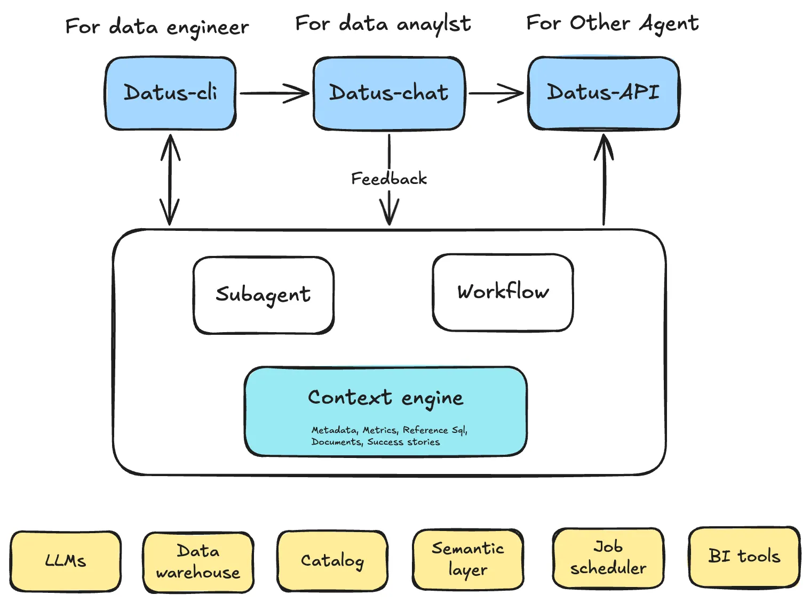
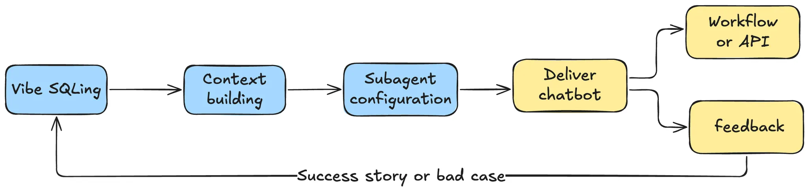
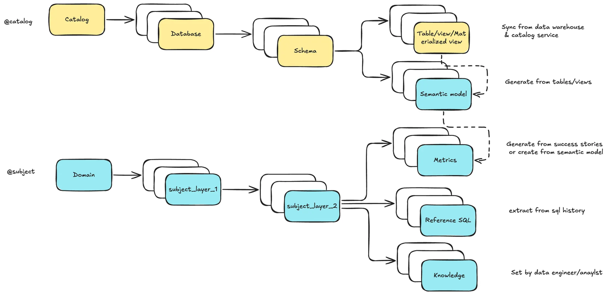
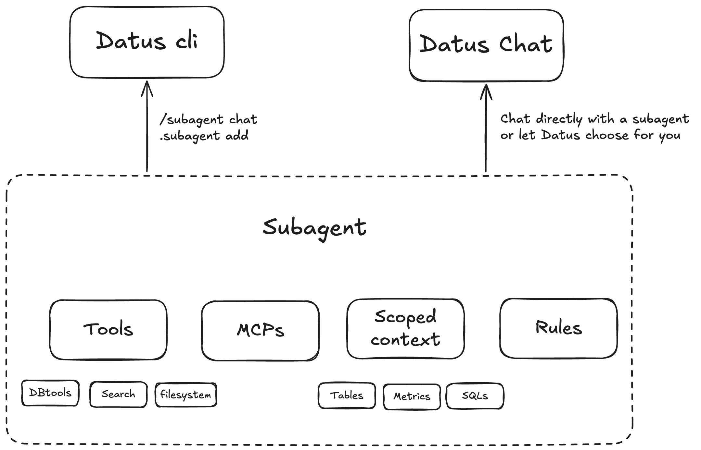
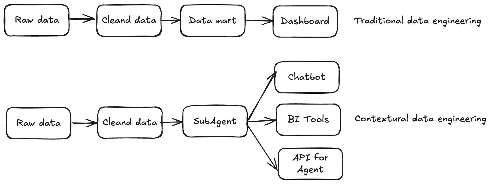

# SQL agents are broken without context. Meet Datus.

## Why SQL agents keep breaking

Most so-called “SQL agents” fail for one simple reason: they don’t actually understand your data. LLMs don’t hallucinate for lack of SQL skills—they do when they lack the governed context behind your schemas, metrics, and business rules.
Data engineering also presents a far larger search space than coding: multiple sources, evolving semantics, inconsistent naming, and legacy edge cases. Put a model in front of raw tables or static docs and you’ll get fragile joins, drifting definitions, and “works on demo, fails in prod.” No context, no reliability. Accuracy is the foundation; great data becomes the moat.

Teams tried two extremes. On one side, pure RAG over dumps of documentation: quick to start, but brittle and hard to keep in sync. On the other hand, heavy knowledge graphs that aspire to encode everything: powerful in theory, but slow to build, costly to maintain, and difficult to evolve. Both approaches demand endless tuning; neither makes the agent learn naturally from your day-to-day work.

## What is Datus?

[Datus](https://github.com/Datus-ai/Datus-agent) is an open-source data engineering agent that builds evolvable context for your data systems. Unlike traditional tools that merely move data, Datus captures, learns, and evolves the knowledge surrounding your data—transforming metadata, reference SQL, semantic models, and metrics into a living knowledge base that grounds AI queries and eliminates hallucinations.

### Naming and open source

The name Datus comes from the Latin word datum, meaning “something that has been given” — or more broadly, "granted knowledge". It shares the same root as data. Interestingly, in Filipino, datus also means “chief” or "leader". Datus is open source (Apache-2.0) because code alone isn’t the moat—clear architecture, well product sence, and conbined with community are. We want context formats, subagent scaffolds, and evaluation sets to be shared, improved, and standardized in the open. That’s how teams compound: by contributing adapters, domain packs, and hard test cases from real life. We need an open-source data engineering agent.

### Architecture

Datus turns context into a first-class, programmable asset for data teams. It has three layers:

1. Interface Layer

One surface, three entry points—sharing the same context and evaluation loop.

- Datus-CLI (for data engineers): build/version context, create & publish subagents, run regressions.
- Datus-Chat (for analysts): self-service Q&A within a scoped domain; feedback is captured automatically.
- Datus-API (for other agents/services): expose stable subagents as programmable endpoints.

2. Engine Layer

The heart of the system: a Context Engine plus two execution styles that share tools/MCP.

- Context Engine: unifies metadata, metrics, reference SQL, docs, and success stories; supports tree + vector recall, model/human editing.
- Subagent system (preferred path): curated tools + scoped context + rules for a specific domain; designed for continuous improvement and evaluation.
- Workflow system (fallback): parallel + selection orchestration to stabilize accuracy when RL/data is insufficient.
- Shared Tools & MCP: native DB/search/lineage tools for consistency; MCP connectors as an extension layer for external APIs/components.

3. External Services Layer
Plugs into your existing stack: LLMs, data warehouses, catalog/lineage, semantic/metrics layers (e.g., MetricFlow), job schedulers, and BI tools. These systems feed facts and definitions into the context and consume the governed outputs.

### User journey and feedback loop

Engineers publish a subagent via CLI → analysts use it in Chat and submit feedback → feedback updates the Context Engine and regression sets → once stable, the subagent is exposed via API and orchestrated with schedulers → external systems keep supplying facts/semantics, and the loop repeats.

For example, data engineers start by seeding a small domain. They chat against the context, correct mistakes, capture “bad cases,” and publish a subagent for analysts to self-serve. Feedback flows back into the context; weekly regression keeps accuracy honest. As the subagent stabilizes, teams expose it as an API for other agents and services. (This mirrors how early users moved from “please fetch this” support to minutes-level self-service.)

## How Datus works (at a glance)

### The Context Engine

Datus organizes context along two axes:

- Physical: real table structures from your catalog/database (catalog → database → schema → table), optionally annotated with a semantic model attached to tables/views (dimensions, measures, definitions).
- Logical/Semantic: a domain tree (domain → topic → subtopic) where metrics, reference SQL, and external notes live. Two-way recall (tree + vector) makes the right context findable, editable, and testable; every correction or success story is tracked to improve future answers.
With the Datus CLI, you browse/edit via @catalog and @subject, batch-bootstrap a knowledge base, and version the context like code. As context matures, you can export it and share it across domains.

### The Subagent system

- Subagents: domain-aware agents (or chatbots) that run with scoped context, minimizing hallucination and improving accuracy via feedback and continuous evaluation.

A subagent is a deployable unit: a curated scoped context + a vetted tool set + rules/policies for a specific business scenario. Think “Retention Analytics subagent” or “Store Operations subagent.” Typical contents might be ~10 key tables, ~20 metrics, ~30 reference SQLs and a few rules—most auto-extracted from history and success cases, then refined by engineers. Datus treats the feedback loop as part of the runtime: chat interactions create evaluations; evaluations refine context; refined context raises accuracy. Over time, subagents can be delivered as a chatbot to analysts and as stable APIs to other agents/microservices.

## Open-source announcement: philosophy and community

Datus is open source (Apache-2.0) because code alone isn’t the moat—clear architecture, well product sence, and conbined with community are. We want context formats, subagent scaffolds, and evaluation sets to be shared, improved, and standardized in the open. That’s how teams compound: by contributing adapters, domain packs, and hard test cases from real life. We need an open-source data engineering agent.

Open development also reflects how agents truly improve: by iterating context and evaluation together, across diverse domains and messy realities—not, not behind a closed demo. When context is programmable and versionable, accuracy becomes repeatable; when evaluations are shared, progress becomes measurable.

## Contextual Data Engineering: why traditional data engineering doesn’t scale

Traditional data engineering pipelines end at delivery—tables built, dashboards published, next request starts. But questions evolve faster than pipelines, and context stays scattered across notebooks, dashboards, ad-hoc SQL, and tribal knowledge.

Contextual Data Engineering flips this model: the pipeline itself becomes a living map of your data system—continuously learning from historical SQL, feedback, and human corrections. Instead of just delivering data, you deliver an iterable context made of metadata, metrics, SQL history, and domain knowledge.

Ultimately, Datus is about building this evolvable context—a living foundation that transforms how data engineering is done. Instead of merely developing tables or static pipelines, engineers can now design flexible, multi-functional, and extensible agents that continuously learn from feedback and evolve with their data systems. Datus bridges engineering precision with intelligent adaptability, turning context into the most valuable asset of modern data work.

## Getting started
- [Installation and quickstart](https://docs.datus.ai/getting_started/Quickstart/)
- [Detailed conception and step by step tutorial of contextual data engineering](https://docs.datus.ai/getting_started/contextual_data_engineering/)
- [Join the slack](https://datusai.slack.com/join/shared_invite/zt-3g6h4fsdg-iOl5uNoz6A4GOc4xKKWUYg)

